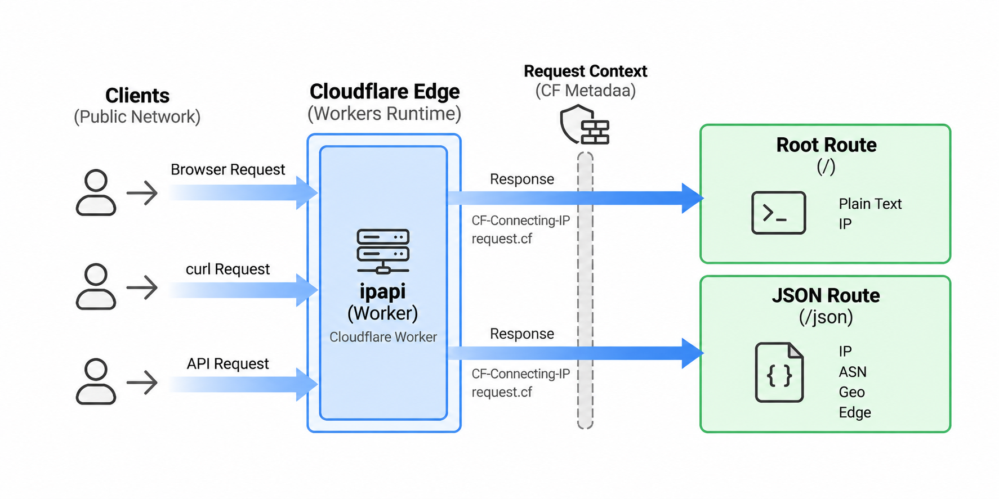

# ipapi


## What is ipapi?

ipapi is a lightweight IP lookup service built on Cloudflare Workers. It returns the client IP directly or provides detailed geolocation, ASN, and edge metadata in JSON format.

## Architecture

ipapi separates static content from dynamic IP lookup. Static assets are generated with Next.js and served directly by Cloudflare, while `/` and `/json` are handled by a Cloudflare Worker.

The Worker uses request metadata provided by Cloudflare, without relying on external IP lookup services.



## Usage

Get IP

```shell
curl -fsSL ip.honeok.com
```

Get JSON metadata

```shell
curl -fsSL ip.honeok.com/json
```

[1]: https://www.cloudflare.com

## LICENSE

Licensed under the [Apache License 2.0](LICENSE).
